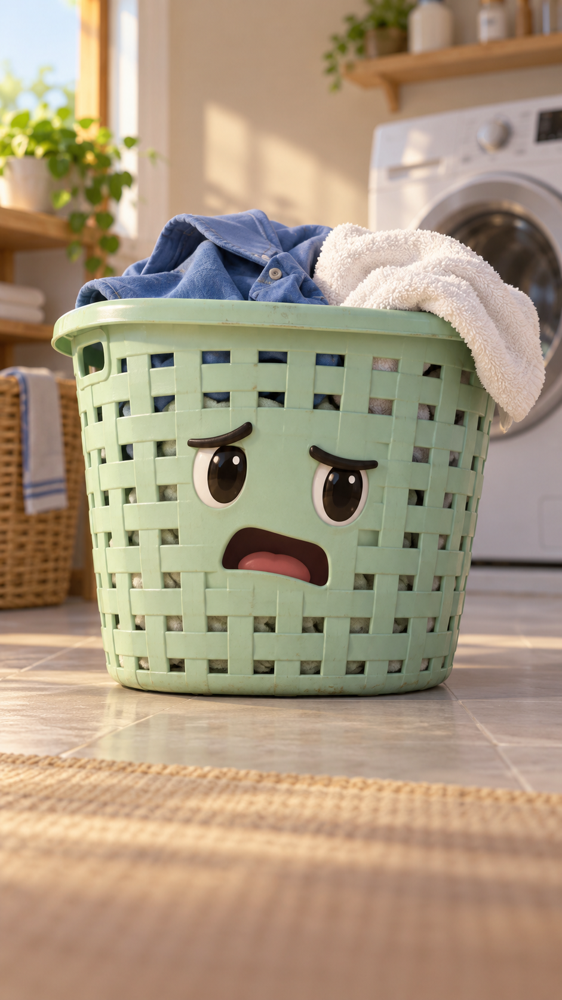

<div align="center">


# ของบ่น · ชุดสร้างคลิปของใช้พูดได้ด้วย AI

**สิ่งของ + นิสัย + เรื่องบ่น → บทไทย → ภาพตัวละคร → Google Flow → คลิปพร้อมซับ**

แจกฟรี **Skill ภาษาไทย · 4 ตัวละครตั้งต้น · บทและ Prompt · ตัวประกอบคลิป 24 วินาที**

[](https://github.com/boombignose/khong-bon/actions/workflows/check.yml)
[](LICENSE)
[](skills/khong-bon/SKILL.md)
[](skills/khong-bon/scripts/khong_bon.py)

**[เริ่มใช้](#start) · [ตัวอย่าง](#examples) · [ติดตั้ง Skill](#skill) · [ประกอบคลิป](#assemble) · [ผลตรวจ](docs/TEST-REPORT.md)**

**[ดาวน์โหลดชุดไฟล์ ZIP](https://github.com/boombignose/khong-bon/archive/refs/heads/main.zip)**

</div>

---

> “เรียกผมว่าแก้วโปรด แต่ไม่เคยล้างผมเลย” ☕
>
> เปลี่ยนของใช้ธรรมดาเป็นตัวละครที่บ่นเจ้าของอย่างขำ ๆ ทำเป็นซีรีส์ในบ้าน คอนเทนต์ร้านค้า หรือคลิปสินค้าเล่าเรื่องตัวเอง

## ในชุดนี้มีอะไร

| 🗣️ คิดมุกและบท | 🎨 ตัวละครตั้งต้น | 🎬 ชุดผลิตแต่ละตอน | 🔤 ประกอบคลิป |
| --- | --- | --- | --- |
| Skill / คำสั่งใช้กับแชต | ภาพและบุคลิก 4 ตัว | character · 3 Prompt · storyboard · ซับ · QC | 3 คลิป → MP4 แนวตั้งพร้อมซับไทย |

**ของที่เอาไปใช้ซ้ำ:** เขียนบทครั้งเดียวใน story.json แล้วสคริปต์จัดชุดผลิตให้ทั้งตอน ตัวละครและฉากถูกใส่ใน Prompt ทุกช็อต บทพูดกับซับมาจากข้อมูลเดียวกัน และหลังโหลดคลิปจาก Flow สามารถประกอบพร้อมซับในเครื่องได้

การ check/pack ใช้ Python อย่างเดียว ไม่ต้องใส่ API key ส่วนการสร้างภาพและคลิปใช้บัญชี AI/Flow ของคุณ และอาจมีค่าเครดิตตามบริการ ไม่มีการควบคุม Flow หรือโพสต์อัตโนมัติ

---

<a id="examples"></a>

## ลองดูของใช้บ่นเจ้าของ

| แก้วโปรด ☕ | แอร์ขี้บ่น ❄️ | ตะกร้าผ้า 🧺 | ขวดน้ำยาล้างจาน 🧴 |
| --- | --- | --- | --- |
|  |  |  |  |
| “ผมเป็นแก้วกาแฟ ไม่ใช่โหลหมักครับ” | “เปิดผมจนหนาว แล้วห่มผ้าสามชั้น” | “พรุ่งนี้ของเดือนอะไรคะ” | “แก้วไม่ได้สะอาดด้วยการมองนะคะ” |
| [บทและ Prompt](examples/mug/pack/storyboard.html) | [บทและ Prompt](examples/aircon/pack/storyboard.html) | [บทและ Prompt](examples/laundry/pack/storyboard.html) | [บทและ Prompt](examples/dish-soap/pack/storyboard.html) |

ภาพในตารางเป็นภาพตั้งต้นที่สร้างด้วย AI ส่วนตัวอย่างน้ำยาล้างจานเป็นสินค้าสมมติ ไม่มีแบรนด์และไม่มีคำกล่าวอ้างสรรพคุณ เปิด storyboard.html หลังดาวน์โหลด ZIP เพื่ออ่านบทและคัดลอก Prompt ได้

### เดโมแก้วกาแฟจาก Google Flow


[เปิดคลิปเดโมและสถานะตรวจ](docs/DEMO.md) · [ดูคลิปประกอบ 24 วินาที](examples/mug/media/demo-24s.mp4)

เดโมเป็นผลทดลองโมเดลจริง **NEEDS_HUMAN_REVIEW** ให้ดูและฟังครบก่อนนำไปโพสต์ ภาพในเดโมอาจต่างจากภาพตั้งต้นในตาราง ดูวิธีสร้างและข้อจำกัดในหน้าเดโม

---

<a id="start"></a>

## เริ่มใช้ใน 3 ขั้น

### 1 · ให้ ChatGPT / Claude สร้างตอนของคุณ

แนบ [SKILL.md](skills/khong-bon/SKILL.md) กับ [STORY.md](skills/khong-bon/references/STORY.md) แล้วสั่ง:

```text
ใช้ชุดของบ่นสร้างคลิป 24 วินาที
สิ่งของ: รีโมตทีวี
นิสัย: กวนแบบสุภาพ
เรื่องบ่น: เจ้าของทำหายทุกวัน ทั้งที่วางไว้ใต้หมอน
ส่ง story.json ตามรูปแบบใน STORY.md
มี 3 ช็อต ช็อตละ 8 วินาที บทพูดภาษาไทย ตัวละครเดียว
```

[คำสั่งแบบเต็มสำหรับคัดลอก](prompts/START.md) ถ้าใช้ local agent ที่ติดตั้ง Skill แล้ว เรียก `$khong-bon` ได้เลย

### 2 · สร้างชุดบทและ Prompt

จากโฟลเดอร์ repo รันตัวอย่างนี้ได้ทันที:

```sh
python3 skills/khong-bon/scripts/khong_bon.py check examples/mug/story.json
python3 skills/khong-bon/scripts/khong_bon.py pack examples/mug/story.json --out runs/mug-01
```

เปิด `runs/mug-01/storyboard.html` ในเบราว์เซอร์ จะได้ character.txt, image-prompt.txt, shot-01.txt ถึง shot-03.txt, subtitles.srt/ass, story.json และ QC.md ใช้โฟลเดอร์ชื่อใหม่เมื่อทำรอบถัดไป สคริปต์ไม่ทับชุดเดิม

บน Windows ใช้ `python` แทน `python3` คำสั่ง check/pack ใช้ Python 3.9+ ไม่ต้อง pip install

### 3 · ทำคลิปใน Flow

เลือกภาพอ้างอิงที่ตรงตัวละคร ตั้ง Video · 9:16 · 8s · x1 และโมเดลที่รองรับเสียง วาง Prompt ทีละช็อต ดูและฟังคลิปจริงก่อนทำต่อ แล้วดาวน์โหลดตามลำดับ

[วิธีทำใน Google Flow และวิธีซ่อมแต่ละจุด](skills/khong-bon/references/FLOW.md) · [Workflow ทั้งชุด](WORKFLOW.md)

---

<a id="assemble"></a>

## ประกอบ 3 คลิปพร้อมซับไทย

ต้องมี FFmpeg และ ffprobe ที่รองรับตัวกรอง libass ติดตั้งจาก [FFmpeg Downloads](https://ffmpeg.org/download.html) ตรวจ `ffmpeg -filters` ว่ามี `ass` ก่อนใช้ บน macOS ที่ใช้ Homebrew หากรุ่นปกติไม่มีตัวกรองนี้ ให้ติดตั้ง `brew install ffmpeg-full` แล้วเพิ่มรุ่น full ใน PATH สำหรับ terminal นี้:

```sh
export PATH="$(brew --prefix ffmpeg-full)/bin:$PATH"
```

```sh
python3 skills/khong-bon/scripts/khong_bon.py assemble examples/mug/story.json --clips examples/mug/media/shot-01.mp4 examples/mug/media/shot-02.mp4 examples/mug/media/shot-03.mp4 --out runs/mug-final.mp4
```

ได้ MP4 720×1280 ยาวประมาณ 24 วินาที พร้อมเสียงและซับไทย สคริปต์ตรวจจำนวนคลิป ความยาวใกล้ 8 วินาที และมี audio/video ก่อนประกอบ ใช้ไฟล์ปลายทางใหม่ ไม่แก้ต้นฉบับ ใส่ขอบเมื่ออัตราส่วนต่างกัน

**เวลาเริ่ม–จบซับเป็นค่าตั้งต้น** ไม่ใช่การถอดเสียง ถ้าต้องปรับตามเสียงจริง ให้ใช้ SRT ใน editor เช่น CapCut หรือ DaVinci Resolve การ assemble สร้างซับใหม่จาก story.json จึงไม่อ่านไฟล์ SRT/ASS ที่แก้มือใน pack

---

<a id="skill"></a>

## ติดตั้ง Skill

คัดลอก **ทั้งโฟลเดอร์** `skills/khong-bon` ไปยังโฟลเดอร์ Skill ของ local agent เพื่อให้ scripts/references/assets อยู่ครบ

| เครื่องมือ | ตำแหน่งที่ใช้กัน |
| --- | --- |
| Codex | `~/.codex/skills/khong-bon/` หรือ `<project>/.agents/skills/khong-bon/` |
| Claude Code | `~/.claude/skills/khong-bon/` หรือ `<project>/.claude/skills/khong-bon/` |
| ChatGPT / Claude ในเว็บ | แนบ SKILL.md + STORY.md แล้วใช้คำสั่งแชต ไฟล์ Python ให้รันในเครื่อง |

ตัวอย่างติดตั้ง Codex บน macOS/Linux โดยไม่ทับ Skill เดิม:

```sh
python3 -c "from pathlib import Path; import shutil; shutil.copytree('skills/khong-bon', Path.home()/'.codex/skills/khong-bon')"
```

หากมี Skill ชื่อนี้อยู่แล้ว ให้ตรวจเวอร์ชันและสำรองก่อนแทนที่

---

<details>
<summary><strong>ไฟล์ในชุด · การทดสอบ · ขอบเขต</strong></summary>

| ไฟล์ | ใช้ทำอะไร |
| --- | --- |
| [Skill](skills/khong-bon/SKILL.md) | เขียนตอนใหม่และใช้สคริปต์ |
| [Schema](skills/khong-bon/references/STORY.md) | รูปแบบข้อมูลที่ AI ต้องส่ง |
| [ตัวละคร](skills/khong-bon/references/CHARACTERS.md) | รูปร่าง เสียง และเรื่องบ่น |
| [แก้ว](examples/mug/story.json) / [แอร์](examples/aircon/story.json) / [ตะกร้า](examples/laundry/story.json) / [น้ำยา](examples/dish-soap/story.json) | ตัวอย่างบทพร้อมรัน |
| [สคริปต์](skills/khong-bon/scripts/khong_bon.py) | check · pack · assemble |
| [ผลตรวจ](docs/TEST-REPORT.md) | สิ่งที่ทดสอบจริงและข้อที่ยังต้องตรวจ |
| [ข้อความแจก](docs/PROMOTION.md) | ร่างโพสต์ Facebook / Kruoop |

```sh
python3 -m unittest discover -s tests -v
python3 scripts/check_repo.py
```

รุ่นแรกใช้ 3 ช็อต × 8 วินาที ไม่มีการเร่งเสียงเพื่อบังคับให้ทัน ไม่รับรองปากตรงเสียงหรือหน้าตาตรงทุกเทค การรักษาตัวละครยังขึ้นกับโมเดลและ reference ต้องดู/ฟังครบก่อนใช้งาน ไม่สร้างเสียงโคลนคนจริง ไม่เปิดเผยสินค้าจริงผิดรูปเป็นภาพสินค้าที่ส่งให้ลูกค้า

</details>

## ใช้และแก้ต่อได้

โค้ดและเอกสารใช้ [MIT](LICENSE) แจกฟรี แก้และประยุกต์ใช้ได้ ดูสิทธิ์ฟอนต์ ภาพและผลลัพธ์ AI ใน [Third-party notices](THIRD_PARTY_NOTICES.md)

สร้างโดย **BoomBigNose** · ทดลองทำตอนแรกด้วยของใช้ใกล้ตัว แล้วค่อยทำเป็นซีรีส์ของคุณ
