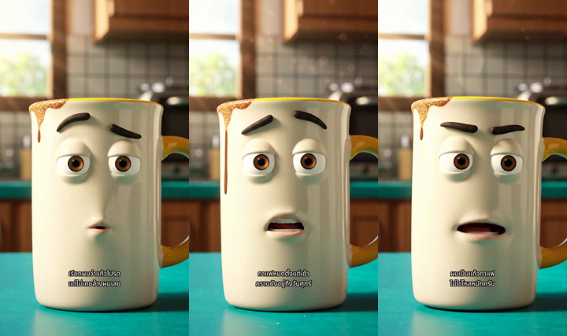

# เดโมแก้วกาแฟ · 24 วินาที

[เปิดคลิปประกอบพร้อมซับ](../examples/mug/media/demo-24s.mp4)

## วิธีสร้าง

- วันที่: 2026-10-09
- บท: [story.json](../examples/mug/story.json) — 3 ช็อต ช็อตละ 8 วินาที บทไทย 3 ประโยค
- ผู้ให้บริการ: Google Flow, Veo 3.1 Lite, 9:16, 720p, 8s, x1, UI แสดง 10 credits ต่อช็อต สร้าง 4 ครั้ง รวมซ่อมช็อต 03 หนึ่งครั้ง (รวม 40 credits ตาม UI)
- ช็อต 01 สร้างจากข้อความ ลักษณะแก้วตามบท ภาพในคลิปจึงต่างจากภาพอ้างอิง imagegen ที่แจก
- ช็อต 02 ใช้เฟรมเริ่มต้นจากเทค 01; ช็อต 03 รุ่นสุดท้ายใช้เฟรม 3 วินาทีจากเทค 01 เพื่อหลีกเลี่ยงตัวเลขที่โมเดลสร้างติดเฟรมเดิม
- ดาวน์โหลดทั้ง 3 คลิปแล้วรัน assemble ด้วย story.json เดียวกัน เผาซับด้วย Noto Sans Thai ที่รวมใน Skill
- project: [ของบ่น — แก้วโปรด](https://flow.google.com/project/b2b58bc1-d670-47f6-9ea6-72702b0cb8f0) ลิงก์นี้ต้องมีสิทธิ์บัญชีเจ้าของ ไม่ใช่ลิงก์สำหรับผู้ดาวน์โหลด ผู้ใช้ทั่วไปดู MP4 ใน repo ได้

| ช็อต | ไฟล์ | บท |
| --- | --- | --- |
| 01 | [ต้นฉบับ](../examples/mug/media/shot-01.mp4) | เรียกผมว่าแก้วโปรด แต่ไม่เคยล้างผมเลย |
| 02 | [ต้นฉบับ](../examples/mug/media/shot-02.mp4) | กาแฟหมดตั้งแต่เช้า คราบยังอยู่ถึงวันศุกร์ |
| 03 | [ต้นฉบับ](../examples/mug/media/shot-03.mp4) | ผมเป็นแก้วกาแฟ ไม่ใช่โหลหมักครับ |

## สถานะตรวจ

**NEEDS_HUMAN_REVIEW** — เป็นตัวอย่างทดลองโมเดลจริง ให้ดูและฟังครบก่อนนำไปโพสต์

ตรวจเทคนิค: แต่ละ input มีภาพ H.264 และเสียง AAC, แนวตั้ง 720×1280, ประมาณ 8 วินาที; output มีภาพ/เสียงครบประมาณ 24 วินาที และมีซับที่สร้างจากบท ตรวจ decode และตัวอย่างเฟรมแล้วตาม TEST-REPORT.md

พบเลขเล็กที่โมเดลสร้างเกินมาในบางเฟรมของเทคเดิม โดยเฉพาะช่วงเริ่มช็อต 01; ซ่อมช็อต 03 โดยเลือกเฟรมสะอาดและเพิ่มข้อห้าม text/letters/numbers ใน Prompt ไม่ได้แก้ช็อต 01/02 ทั้งหมด รุ่นนี้จึงยังไม่ใช่คลิป QC ผ่านพร้อมโพสต์

ลองถอดเสียงด้วย Whisper base ภาษาไทย พบช่วงบทพูดทั้ง 3 ช่วงแต่สะกดคลาดเคลื่อน จึงไม่ใช้ผลนี้รับรองการออกเสียงหรือคำพูดครบ

การตรวจไฟล์และภาพบางเฟรมยังไม่รับรองว่าภาษาไทยทุกคำถูกต้อง เสียงเหมือนกันทั้ง 3 ช็อตหรือปากตรงเสียง ซับมีเวลาเริ่มต้น 0.6–7.4 วินาทีต่อช็อต ไม่ใช่ผลถอดเสียง ให้ปรับใน editor เมื่อจังหวะต่างจากเสียงจริง

ตัวอย่างแอร์ ตะกร้า และน้ำยาล้างจานในชุดมีภาพตั้งต้นและ pack ของบท/Prompt พร้อมลอง แต่ยังไม่มีคลิปเรนเดอร์ในรุ่นนี้
